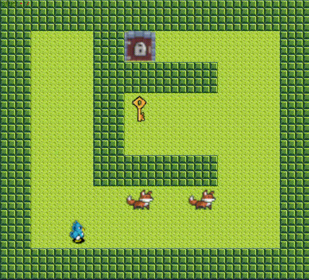

# so_long

**so_long** is a 2D game project developed as part of the 42 School curriculum. The objective of the project is to create a simple game using the MiniLibX graphical library, with basic gameplay mechanics, a custom map, and player interactions.

## Features

- 2D grid-based game world
- Player movement in four directions (up, down, left, right)
- Collectibles scattered across the map
- An exit that becomes accessible after collecting all items
- Basic enemy behavior (bonus)
- Customizable maps

## How to Build (MANDATORY)

1. Clone the repository:
   ```bash
   git clone https://github.com/seg-fault0/so_long.git
   cd so_long
   ```
### MANDATORY
2. Build the project Makefile:
   ```bash
   make
   ```
3. Run the project
	```bash
	./so_long ./maps/map.ber
	```

### BONUS
2. Build the project Makefile:
   ```bash
   make bonus
   ```
3. Run the project
	```bash
	./so_long_bonus ./maps/bmap.ber
	```


## Controls

- **W / Up Arrow**: Move up
- **A / Left Arrow**: Move left
- **S / Down Arrow**: Move down
- **D / Right Arrow**: Move right
- **ESC**: Quit the game

## Map Format

The map is defined in a `.ber` file, which is a simple text file containing characters that represent different elements of the game:

- `1`: Wall
- `0`: Empty space
- `C`: Collectible
- `E`: Exit
- `P`: Player starting position
- `B`: Enemy (bonus)

### Example Map
```
111111
1P0C01
100001
1C0E11
111111
```

## Rules

1. The map must be surrounded by walls (`1`) on all sides.
2. There must be exactly one player (`P`) and at least one exit (`E`) and one collectible (`C`).
3. The player can only exit the game after collecting all items.


## GamePlay
